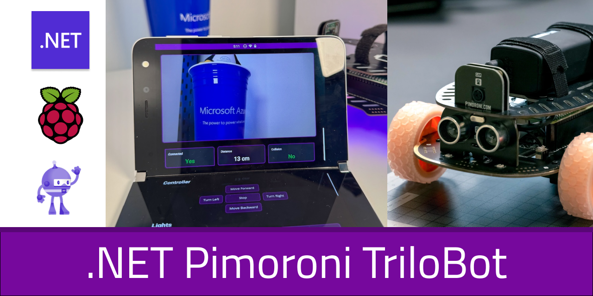

# 🤖 Trilobot.NET
<p align="center">
  
</p>


A C# .NET library for controlling the [Pimoroni Trilobot](https://shop.pimoroni.com/products/trilobot) robot platform on a Raspberry Pi using .NET IoT. This project aims to provide a SignalR C# API for all TriloBot features. With a Blazor and a .NET MAUI app.


## 🚀 What Does It Do?

This library provides easy-to-use manager classes for all major Trilobot hardware components:

- 🦾 **Driving around** – Drive, steer, and control both motors with speed and direction
- 🕹️ **Buttons** – Read and react to button presses (A, B, X, Y) with observable events
- 💡 **Lights, LEDs and more** – Control underlighting (RGB LEDs) and button LEDs, including color effects
- 📏 **Keep distance** – Measure distance and proximity with the ultrasonic sensor, with observable events
- 📸 **Live Feed** – Take photos and (optionally) stream live video (SignalR/MJPEG integration)
- 🎮 **Xbox Controller (wired 360)** – Remote-drive the robot: left stick steers, RT forward, LT backward; A/B/X/Y mapped to actions

## Status

|Service|Name|State|
|-|-|-|
|Action|Build TriloBot.Core|[](https://github.com/tscholze/dotnet-iot-raspberrypi-trilobot/actions/workflows/dotnet-build-core.yml)|
|Action|Build TriloBot.Blazor|[](https://github.com/tscholze/dotnet-iot-raspberrypi-trilobot/actions/workflows/dotnet-build-blazor.yml)|
|Action|Build TriloBot.Maui|-|

## How it looks

### Outside
|                                    |                                    |
| ---------------------------------- | ---------------------------------- |
|  |  |

### Android (Surface Duo)

|                                         |     |
| --------------------------------------- | --- |
|  |     |

### Windows
|                                  |                            |
| -------------------------------- | -------------------------- |
|  |  |
|   |                            |


## 🔧 Hardware Components (Pimoroni Trilobot)

- 4 x Programmable Buttons (A, B, X, Y)
- 4 x Button LEDs (RGB)
- 6 x Underlighting RGB LEDs
- 2 x Motors (left/right, PWM control)
- 1 x Ultrasonic Distance Sensor
- 1 x Camera (Raspberry Pi Camera Module, optional)


## 🛠️ Architecture

Each hardware subsystem is managed by its own class:

| Manager Class       | Responsibility                                       |
| ------------------- | ---------------------------------------------------- |
| `ButtonManager`     | Handles button state, debouncing, and events         |
| `LightManager`      | Controls all LEDs and underlighting                  |
| `MotorManager`      | Abstracts motor control and movement                 |
| `UltrasoundManager` | Provides distance readings and proximity events      |
| `CameraManager`     | Photo captures and other image related operations in |

All managers are composed in the main `TriloBot` class, which exposes observables and high-level control methods. All hardware mappings use enums and extension methods for clarity and maintainability.

## 🎮 Xbox Controller Support (wired Xbox 360)

TriloBot.NET can be remote-controlled using a wired Xbox 360 controller on Linux (Raspberry Pi OS). The `RemoteControllerManager` reads raw Linux input events from `/dev/input/event*` and exposes clean observables you can react to.

What’s supported:
- Left stick X controls horizontal steering (−1.0 … 1.0)
- Right Trigger (RT) drives forward (0.0 … 1.0)
- Left Trigger (LT) drives backward (0.0 … 1.0)
- A/B/X/Y buttons fire events (edge-triggered on press)

How to use:

```csharp
using var robot = new TriloBot();
using var manager = new TriloBot.RemoteController.RemoteControllerManager();

// Horizontal: map left stick X to left/right turning
controller.HorizontalMovementObservable.Subscribe(value =>
{
    roboter.move(...)
});

// Vertical: RT forward minus LT backward
controller.VerticalMovementObservable.Subscribe(value =>
{
    roboter.move(...)
});

// Buttons: map A/B/X/Y to actions
controller.ButtonPressedObservable.Subscribe(button =>
{
    switch(button) 
    {
        case A: ...
    }
});
```

Notes and requirements:
- Linux only (uses the input subsystem at `/dev/input/event*`).
- You may need permissions; if you get a permission error, run with `sudo` or add a udev rule to grant access.
- Dead zones and a movement threshold are applied to avoid noise and stick drift.

## 🕸️ SignalR architecture

TriloBot uses SignalR for real-time communication between the robot runtime and client UIs (Blazor, .NET MAUI).

High-level overview:
- The robot process hosts a SignalR hub that exposes commands (e.g., drive, lights, camera) and streams events from hardware managers (buttons, distance, movement state).
- The Blazor/web client and MAUI app connect to this hub to send commands and display live updates.
- Video streaming is handled separately via MediaMTX; the UI consumes the stream URL while still using SignalR for control and telemetry.

Conceptual flow:
- Client → Hub (commands): drive operations, lighting changes, start/stop monitoring, take photo, etc.
- Hub → Client (events): button pressed, distance changed/object too near, movement updates, light state, camera events.

How to run:
- Start the robot app (hosts the SignalR hub):
    ```sh
    dotnet run --project TriloBot
    ```
- Start the web UI (connects to the hub):
    ```sh
    dotnet run --project TriloBot.Blazor
    ```
- Optional: start the MediaMTX server for the camera feed:
    ```sh
    cd _thirdparty/webrtc && mediamtx
    ```

Notes:
- The exact hub endpoints and schemas are internal implementation details; use the provided UI apps as references.
- Ensure the robot host and clients can reach each other over the network (open firewall if needed).

## 🚀 Getting Started

### Prerequisites
- Raspberry Pi 4
- Pimoroni Trilobot
- Enabled GPIO, CSI, SPI, IC2 interfaces
- .NET 9.0 SDK or newer
- Basic knowledge of C# and .NET
- Binary of [MediaMTX](https://github.com/bluenviron/mediamtx) must be placed into `_thirdparty/webrtc`

### Installation
1. Clone this repository:
   ```sh
   git clone https://github.com/tscholze/dotnet-iot-raspberrypi-trilobot.git
   cd dotnet-iot-raspberrypi-trilobot
   ```
2. Run the demo (see `TriloBot/Program.cs`):
   ```sh
   dotnet run --project TriloBot
   ```
3. To run for example the web client:
    ```sh
    dotnet run --project TriloBot.Blazor
    ```
4. To start the web cam feed:
   ```sh
   cd _thirdparty/webrtc && mediamtx
   ```

## 📖 Documentation & Usage Examples

Each manager class is fully documented with XML comments. See the source code for API details.

### Basic Usage

```csharp
using var robot = new TriloBot();

// Start distance monitoring and react to proximity
robot.StartDistanceMonitoring();
robot.ObjectTooNearObservable.Subscribe(tooNear =>
{
    if (tooNear)
        robot.FillUnderlighting(255, 0, 0); // Red if too close
    else
        robot.FillUnderlighting(0, 255, 0); // Green otherwise
});

// Listen for button presses
robot.StartButtonMonitoring();
robot.ButtonPressedObservable.Subscribe(button =>
{
    if (button == Buttons.ButtonA)
        robot.Forward();
    else if (button == Buttons.ButtonB)
        robot.Backward();
    else if (button == Buttons.ButtonX)
        robot.TurnLeft();
    else if (button == Buttons.ButtonY)
        robot.TurnRight();
});

// Set underlighting to blue
robot.FillUnderlighting(0, 0, 255);

// Take a photo (async)
string photoPath = await robot.TakePhotoAsync("/home/pi/photos");
Console.WriteLine($"Photo saved to: {photoPath}");
```


## 🙏 Acknowledgments
- [Pimoroni](https://shop.pimoroni.com/products/trilobot) for the Trilobot hardware
- .NET IoT team for the System.Device.Gpio library
- Community contributors


## 📜 License

This project is licensed under the MIT License - see the LICENSE file for details.

## 🤝 Contributing

Contributions are welcome! Please feel free to submit a Pull Request.

## ❤️ More IoT projects of mine
I like to tinker around with Raspberry Pis, I created a couple of educational apps and scripts regarding the Pi and sensors - mostly from Pimoroni.

### .NET on Raspberry Pi 
- [dotnet-iot-raspberrypi-blinkt](https://github.com/tscholze/dotnet-iot-raspberrypi-blinkt) A C# .NET implementation for the Pimoroni Blinkt! LED board on a Raspberry Pi.
- [dotnet-iot-raspberrypi-enviro](https://github.com/tscholze/dotnet-iot-raspberrypi-enviro) A C# .NET implementation for the Pimoroini Enviro HAT with BMP, TCS and more sensors
- [dotnet-iot-raspberrypi-rainbow](https://github.com/tscholze/dotnet-iot-raspberrypi-rainbow) A C# .NET implementation for the Pimoroini Rainbow HAT with Lights, BMP, segment displays and more

### Windows 10 IoT Core apps
- [dotnet-iot-homebear-blinkt](https://github.com/tscholze/dotnet-iot-homebear-blinkt) Windows 10 IoT Core UWP app that works great with the Pimoroni Blinkt! LED Raspberry Pi HAT.
- [dotnet-iot-homebear-tilt](https://github.com/tscholze/dotnet-iot-homebear-tilt) Windows 10 IoT Core UWP app that works great with the Pimoroni Pan and Tilt HAT (PIC16F1503)
- [dotnet-iot-homebear-rainbow](https://github.com/tscholze/dotnet-iot-homebear-rainbow) Windows 10 IoT Core UWP app that works great with the Pimoroni RainbowHAT

### Android Things apps
- [java-android-things-firebase-pager](https://github.com/tscholze/java-android-things-firebase-pager) An Android Things app that displays a Firebase Cloud Messaging notification on a alphanumeric segment control (Rainbow HAT)
- [java-android-things-tobot](https://github.com/tscholze/java-android-things-tobot) An Android Things an Google Assistant app to controll a Pimoroni STS vehicle by web and voice

### Python scripts
- [python-enviro-gdocs-logger](https://github.com/tscholze/python-enviro-gdocs-logger) Logs values like room temperature and more to a Google Docs Sheet with graphs
- [python-enviro-excel-online-logger](https://github.com/tscholze/python-enviro-excel-online-logger) Logs values like room temperature and more to a M365 Excel Sheet with graphs
- [python-enviro-azure-logger](https://github.com/tscholze/python-enviro-azure-logger) Logs values like room temperature and more to an Azure IoT Hub instance
